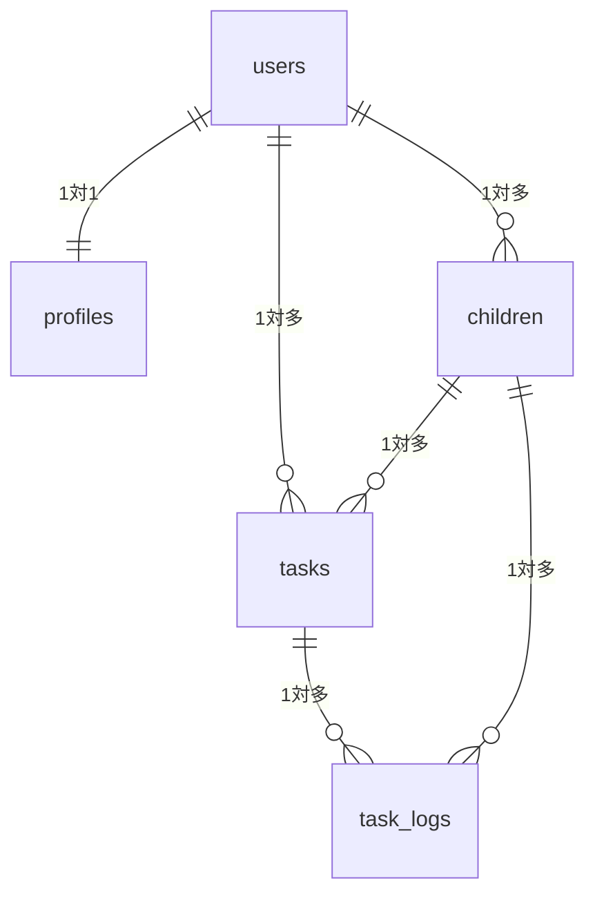

# oyako-todo

## コンセプト
働きながら子どもの学習・お手伝い・自分のタスクを同時に管理できる、  
**「親子共通のTODO&ポイント管理アプリ」。**

## ER図（暫定）

## users

- `users`は、Supabaseがログイン用に用意している`auth.users`を使う想定
- アプリで使う名前などの情報は`profiles`テーブルから見る予定

## profiles テーブル

| カラム名      | 型         | 必須 | 説明                                      |
|--------------|------------|------|-------------------------------------------|
| id           | uuid       | Yes  | auth.users.idと同じ値（PK/FK）        |
| display_name | text       | Yes  | 表示名（親の名前orニックネーム）       |
| created_at   | timestamptz| Yes  | 作成日時（`now()`デフォルト）           |

## children テーブル

| カラム名    | 型         | 必須 | 説明                                    |
|------------|------------|------|-----------------------------------------|
| id         | uuid       | Yes  | 子どもID（PK）                          |
| user_id    | uuid       | Yes  | 親ユーザーID（profiles.idへのFK）    |
| name       | text       | Yes  | 子どもの名前                            |
| grade      | text       | No   | 学年（例：'小4', '小1'など）           |
| icon_color | text       | No   | アイコンカラーなど見た目用             |
| created_at | timestamptz| Yes  | 作成日時                                |

## tasks テーブル

| カラム名        | 型         | 必須 | 説明                                              |
|----------------|------------|------|---------------------------------------------------|
| id             | uuid       | Yes  | タスクID（PK）                                    |
| user_id        | uuid       | Yes  | 親ユーザーID（profiles.idへのFK）              |
| child_id       | uuid       | Yes  | 対象の子どもID（children.idへのFK）            |
| title          | text       | Yes  | タスク名（例：漢検ドリル1ページ、お手伝いetc.） |
| category       | text       | Yes  | カテゴリ（'study', 'chore', 'life'など）        |
| point          | integer    | Yes  | 1回あたりのポイント                              |
| frequency_type | text       | No   | 繰り返し種別（'daily'/'weekly'など）          |
| frequency_value| integer    | No   | 週◯回などの回数                                  |
| is_active      | boolean    | Yes  | 有効フラグ（true=表示、false=非表示）           |
| created_at     | timestamptz| Yes  | 作成日時                                          |

## task_logs テーブル

| カラム名  | 型         | 必須 | 説明                                              |
|----------|------------|------|---------------------------------------------------|
| id       | uuid       | Yes  | ログID（PK）                                      |
| task_id  | uuid       | Yes  | 対象タスクID（tasks.idへのFK）                 |
| child_id | uuid       | Yes  | 実行した子どもID（children.idへのFK）          |
| user_id  | uuid       | Yes  | 親ユーザーID（profiles.idへのFK）              |
| done_date| date       | Yes  | 実行日（「何日分の実績か」を集計しやすくする）   |
| done_at  | timestamptz| Yes  | 実行日時（チェックした日時）                      |
| point    | integer    | Yes  | この実行で付与されたポイント（タスク変更に備え） |
| memo     | text       | No   | 任意のメモ（例：よくがんばった！など）           |
