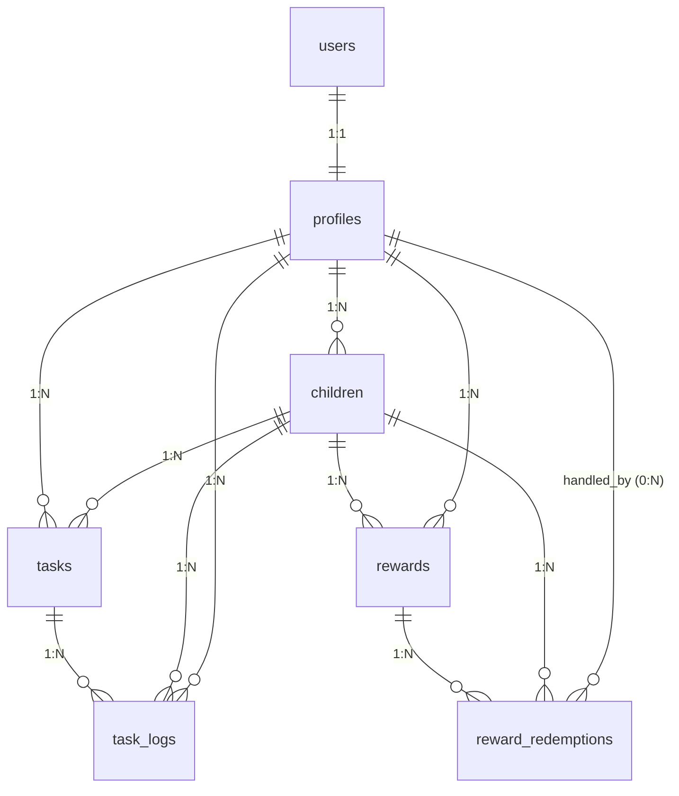

# 親子向けごほうび管理アプリ

## コンセプト
子どもの学習やお手伝いの達成を  
**ポイントとごほうび交換**として管理できる、  
親子向けのごほうび管理アプリ。

---

## 主な機能

### ごほうび管理
- 親によるごほうびカタログの登録
- 子どもによるごほうび交換申請
- 親による承認 / 却下

### ポイント管理
- 子どもごとに現在ポイントを保持
- タスク完了 / やりなおしによるポイント増減
- ごほうび交換（承認）時にポイントを消費

### タスク管理
- 子どもごとのタスク登録
- カテゴリ別（学習 / お手伝い / 生活）
- タスク完了 / やりなおしの切り替え

---

## 画面・ルート一覧

### 親向け
- `/` : ダッシュボード
- `/tasks` : タスク管理
- `/rewards` : ごほうび管理
- `/redemptions` : 交換申請管理
- `/mypage` : 親・子ども管理

### 子ども向け
- `/child` : タスク一覧
- `/child/rewards` : ごほうび交換申請
- `/child/redemptions` : 申請履歴

### 認証
- `/signin`
- `/signup`

---

## 技術スタック

- フロントエンド  
  - Next.js（App Router）
  - React
  - TypeScript
  - Mantine（UIコンポーネント）

- バックエンド / インフラ  
  - Supabase  
    - Authentication  
    - PostgreSQL  
    - Row Level Security（RLS）

---

## ディレクトリ構成（App Router）

```
src/
  app/
    (auth)/
      signin/
        page.tsx
      signup/
        page.tsx
    (parent)/
      page.tsx
      tasks/
        page.tsx
        create/
          page.tsx
        [id]/
          edit/
            page.tsx
      rewards/
        page.tsx
      redemptions/
        page.tsx
      mypage/
        page.tsx
    (child)/
      child/
        page.tsx
        rewards/
          page.tsx
        redemptions/
          page.tsx
    api/
      logout/
        route.ts
  components/
  lib/
    supabaseClient.ts
    supabase/
      server.ts
```

---

## ER図



---

## データベース設計（詳細）

### users
- 認証は Supabase Auth の `auth.users` を利用
- アプリ固有のユーザー情報は `profiles` テーブルで管理

### profiles

| カラム名 | 型 | 必須 | 説明 |
| --- | --- | --- | --- |
| id | uuid | Yes | auth.users.id と同一（PK / FK） |
| display_name | text | Yes | 親の表示名 |
| created_at | timestamptz | Yes | 作成日時 |

### children

| カラム名 | 型 | 必須 | 説明 |
| --- | --- | --- | --- |
| id | uuid | Yes | 子どもID（PK） |
| user_id | uuid | Yes | 親ユーザーID（profiles.id） |
| name | text | Yes | 子どもの名前 |
| grade | text | No | 学年 |
| icon_color | text | No | 表示用カラー |
| points | integer | Yes | 現在ポイント（default: 0） |
| created_at | timestamptz | Yes | 作成日時 |

### tasks

| カラム名 | 型 | 必須 | 説明 |
| --- | --- | --- | --- |
| id | uuid | Yes | タスクID（PK） |
| user_id | uuid | Yes | 親ユーザーID |
| child_id | uuid | Yes | 対象の子どもID |
| title | text | Yes | タスク名 |
| category | text | Yes | study / chore / life |
| point | integer | Yes | 付与ポイント |
| frequency_type | text | No | daily / weekly など |
| frequency_value | integer | No | 回数指定 |
| is_done | boolean | Yes | 完了フラグ |
| created_at | timestamptz | Yes | 作成日時 |

### point_transactions

| カラム名 | 型 | 必須 | 説明 |
| --- | --- | --- | --- |
| id | bigint | Yes | 取引ID（PK / identity） |
| child_id | uuid | Yes | 子どもID（必須） |
| task_id | bigint | No | タスク関連ID（任意） |
| reward_redemption_id | bigint | No | 交換申請ID（任意） |
| type | text | Yes | 取引種別（例：task_done / task_undo） |
| points | integer | Yes | 増減ポイント |
| note | text | No | 表示用メモ |
| created_at | timestamptz | No | 作成日時 |

### rewards

| カラム名 | 型 | 必須 | 説明 |
| --- | --- | --- | --- |
| id | bigint | Yes | ごほうびID（PK / identity） |
| parent_id | uuid | Yes | 親ユーザーID |
| child_id | uuid | Yes | 対象の子どもID |
| title | text | Yes | ごほうび名 |
| description | text | No | 説明 |
| required_points | integer | Yes | 必要ポイント |
| image_url | text | No | 画像URL |
| is_active | boolean | Yes | 有効フラグ |
| created_at | timestamptz | No | 作成日時 |

### reward_redemptions

| カラム名 | 型 | 必須 | 説明 |
| --- | --- | --- | --- |
| id | bigint | Yes | 交換申請ID（PK / identity） |
| child_id | uuid | Yes | 申請した子どもID |
| reward_id | bigint | Yes | rewards.id |
| status | text | Yes | pending / approved / rejected |
| requested_at | timestamptz | No | 申請日時 |
| handled_by | uuid | No | 処理した親ユーザー |
| handled_at | timestamptz | No | 処理日時 |
